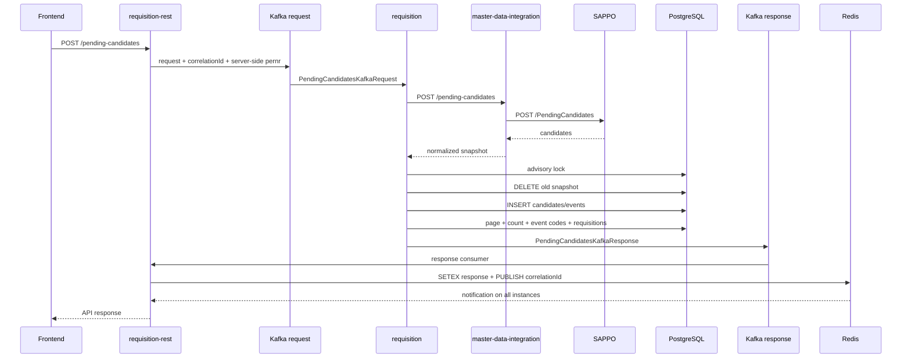
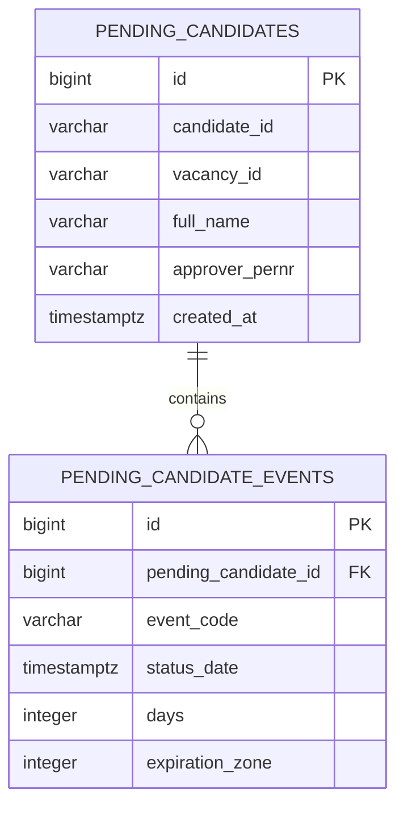

# Pending candidates — полная референсная реализация

Реализация покрывает три сервиса и общий контракт:

- `srhr-ms-requisition-rest` — REST, Kafka request, Redis request-reply;
- `srhr-ms-requisition` — вызов master-data, транзакционный снимок, SQL-фильтрация, пагинация, обогащение, Kafka response;
- `srhr-ms-master-data-integration` — внутренний endpoint и вызов SAPPO;
- `pending-candidates-contracts` — DTO REST, SAPPO/internal и Kafka.

Технологическая база: Java 17, Spring Boot 3.2.0, PostgreSQL, Liquibase, Kafka, Redis, `NamedParameterJdbcTemplate`.

## Что реализовано

1. `POST /pending-candidates` в `srhr-ms-requisition-rest`.
2. Получение `pernr` текущего пользователя вне тела фронтового запроса.
3. Kafka-запрос в `srhr.requisition.to.easup`.
4. Redis request-reply без polling и `Thread.sleep`:
   - Kafka consumer сохраняет ответ с TTL;
   - публикует correlation ID в Redis Pub/Sub;
   - экземпляр, владеющий HTTP-запросом, завершает `CompletableFuture`.
5. Kafka listener в `srhr-ms-requisition`.
6. Вызов `srhr-ms-master-data-integration POST /pending-candidates`.
7. Вызов SAPPO `POST /PendingCandidates`.
8. Транзакционная замена снимка по `approver_pernr`.
9. Защита параллельных обновлений одного согласующего через PostgreSQL advisory lock.
10. SQL-фильтрация:
    - пользователь по `approver_pernr`;
    - регистронезависимый поиск подстроки ФИО;
    - этапы по логике ИЛИ через `EXISTS`;
    - стабильная сортировка кандидатов;
    - `LIMIT/OFFSET`.
11. Отдельный `count` с теми же фильтрами.
12. Все уникальные коды событий по кандидатам, прошедшим фильтры.
13. Загрузка событий страницы одним запросом и сортировка `status_date ASC, id ASC`.
14. Обогащение заявками двумя bulk-запросами, без N+1.
15. Доменные/транспортные ошибки и HTTP mapping.
16. WireMock-тест интеграции с SAPPO.
17. Testcontainers-тест транзакционного снимка и SQL-фильтров.

## Основной поток



## Модель данных



## Семантика SQL

### Фильтр этапов

Кандидат попадает в выборку, если у него существует хотя бы одно событие с кодом из `eventCodeList`:

```sql
and exists (
    select 1
    from pending_candidates_events event_filter
    where event_filter.pending_candidate_id = pc.id
      and event_filter.event_code in (:eventCodes)
)
```

Обычный `JOIN` для основной страницы намеренно не используется: несколько совпавших событий не должны дублировать кандидата и ломать `count`/пагинацию.

### Поле `eventCode`

Текущая реализация сначала применяет все фильтры к кандидатам, включая `eventCodeList`, а затем возвращает **все уникальные коды событий этих кандидатов**. То есть совпадение фильтра определяет кандидатов, но не обрезает их события до выбранных кодов.

### Сортировка

- кандидаты: `lower(full_name) ASC, id ASC`;
- события: `status_date ASC, id ASC`.

### Транзакционность

Внешний вызов выполняется до транзакции. После успешного ответа запускается транзакция:

1. advisory lock по `pernr`;
2. удаление старого снимка;
3. вставка нового снимка;
4. commit.

При ошибке вставки транзакция откатывается и старый снимок восстанавливается. При ошибке SAPPO транзакция вообще не начинается. Успешный пустой ответ удаляет старый снимок.

## Три места, которые надо сопоставить с реальным репозиторием

Исходный код сервисов не был предоставлен, поэтому только эти адаптеры нельзя достоверно привязать к вашим именам классов и таблиц:

### 1. Обогащение заявки

Файл:

```text
srhr-ms-requisition/.../RequisitionEnrichmentRepository.java
```

В референсе предполагаются таблицы:

```text
vacancy
requisition
requisition_struct_unit_path
```

Нужно заменить два SQL на фактическую схему проекта. Контракт и bulk-алгоритм уже готовы.

### 2. Получение текущего `pernr`

Файл:

```text
srhr-ms-requisition-rest/.../CurrentUserPernrResolver.java
```

Для запуска примера используется request attribute `pernr` с fallback на `X-Pernr`. В боевом сервисе это надо связать с существующим JWT/SystemParams-контекстом. `pernr` не должен приниматься из JSON фронта.

### 3. Существующий Kafka envelope

В референсе используются отдельные records:

```text
PendingCandidatesKafkaRequest
PendingCandidatesKafkaResponse
```

Если проект уже имеет общий envelope (`requestType`, channel, sessionId, traceId и т. п.), поля нужно перенести в него, сохранив `correlationId`, `pernr` и page request.

## Запуск тестов

Требования:

- JDK 17;
- Maven 3.9+;
- Docker для Testcontainers.

```bash
mvn clean test
```

## Локальная инфраструктура

```bash
docker compose up -d
```

Порты:

- PostgreSQL: `5432`;
- Redis: `6379`;
- Kafka: `9092`;
- WireMock SAPPO: `9090`.

Пример запроса:

```bash
curl -X POST http://localhost:8080/pending-candidates \
  -H 'Content-Type: application/json' \
  -H 'X-Pernr: 12345678' \
  -d '{
    "page": 1,
    "pageSize": 20,
    "filter": {
      "search": "Иванов",
      "eventCodeList": ["rr_resume_review"]
    }
  }'
```

## Что не следует переносить без адаптации

- тестовый fallback на заголовок `X-Pernr`;
- названия таблиц в `RequisitionEnrichmentRepository`;
- номера портов;
- названия package;
- отдельный contracts-модуль, если DTO уже находятся в `srhr-mod-commons`;
- общие exception handlers, если в сервисах уже есть собственная иерархия `DomainException` и `RestControllerAdvice`.
